## Python Environment

Create a Python Environment:

> python -m venv ~/Desktop/venv

Activate your Python Environment:

> source venv/bin/activate

or

> source venv/Scripts/activate

Install Required Packages for the Package or It's Sub-Modules:

> pip install -r ~/.../requirements.txt

You may run into an error building wheels for packages you want to install via pip from within VSCode. If this occurs, your terminal's error log will direct you to install Visual Studio Build Tools

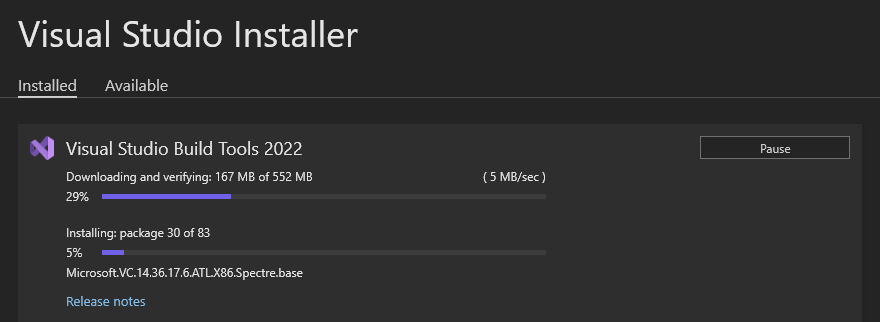

Run a Python Script:

> python ~/.../main.py

If you setup your repository well, you should be able to import functions and data from other directories by using paths like:

> "../file.csv"         <- which will look one directory up from where your script is and find file.csv there 

But in some cases, I have pulled my hair out trying to import some function or file from a directory one level up and in another folder.

To quickly get to working on your programs, you can use the following imperfect, but beneficial modifier to your system's path below.

Add the Repository's High Level Path to Your Script to Import Any Submodule:

> sys.path.insert(1, '~/project-name')

or 

> sys.path.insert(1, '~\\project-name')

Inserting your project's path to your SYSPATH variables in Python files will allow you to import files and functions with ease.

Ask your company's resident developer, devops engineer, or start learning more about relative imports, python package modules, and the __init__ file for more information on imports.

## Python Notebook Environment in VSCode

Run line of code in a notebook and select a kernel:

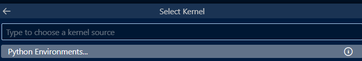

Create an isolated python environment:

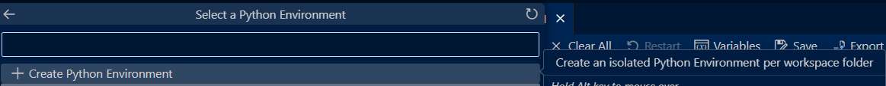

Create a .venv in the current workspace's root to act as your python notebook kernel:

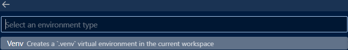

Enter the interpreter's path:

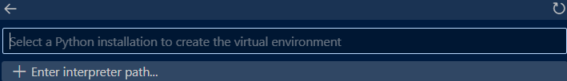

Install requirements from your txt file:

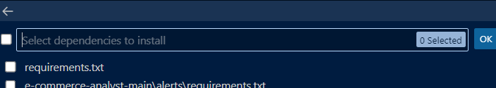

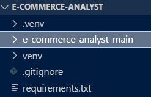

## Possible Additional Steps to Setup Interactive Notbeook Kernel to Run Code in Interactive Windows using VSCode

> ctrl + shift + p

Will allow you to search VSCode settings.

Search for an option to run selected lines of code in an interactive terminal. Install the required packages when prompted.

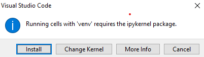

To setup an efficient environment, I prefer to add a keyboard shortcut that allows me to run selected lines in a .py file in a split-screened interactive window.

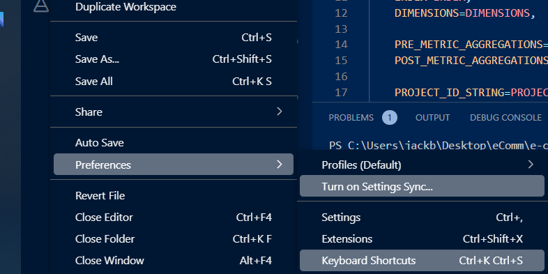

In my case, shift+enter was set to run selected code in a python terminal instead of the jupyter interactive window. I changed the existing run in python terminal to unused keyboard shortcut bindings.

The keyboard shortcut still did not work as expected on my computer.. To correct, I opened up a new interactive window tab and noticed that my existing python environment is used as the interpreter.

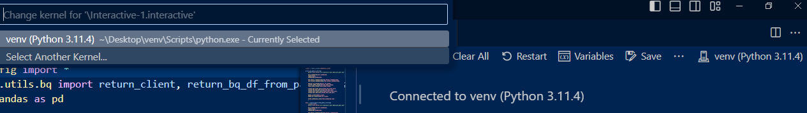

The new kernel directory is defined as .venv instead of venv

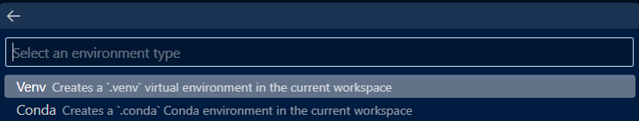

I set the existing venv path as the interpreter and am prompted to intall dependencies from a requirements.txt file. In this case, I install the root directory's requirements.

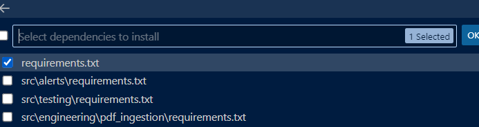

Finally, I needed to enter Jupyter settings and enable sending selected code to the interactive window. This allowed me to hit Shift+Enter and run code in the interactive window.

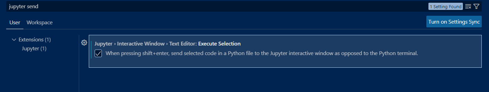